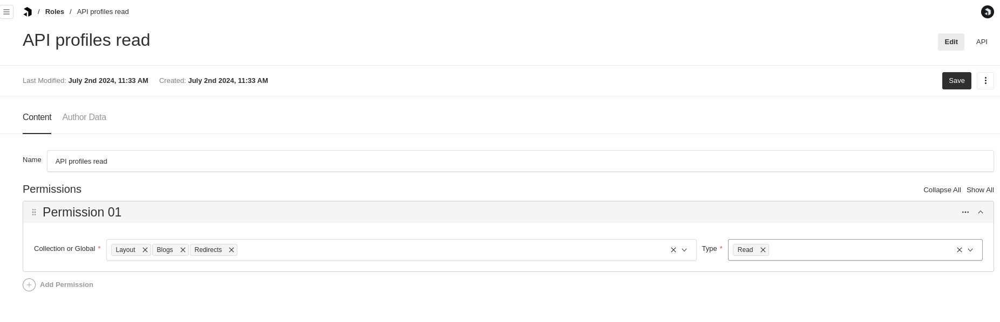
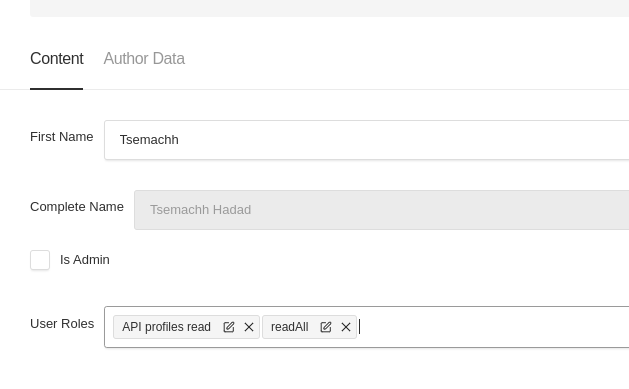

# Shefing Payload Admin Helpers

Helpers and practices to start payload cms admin project

This project was built with [PayloadCMS](https://payloadcms.com/) and [Next.js 15](https://nextjs.org/), focusing on providing substance and mental health counseling services.

## Table of Contents

- [✨ Features](#features)
  - Researcher to Author workflow
    (Right Panel , Quotes , Media)
  - Control who can publish content
  - Using field level security to control which fields are in the API
  - Produce cover image from video
  - Block removal of media if referenced from publishable content
  - Right panel open relation
  - Generating content from selection in rich text (TextFromSelectionField)
  - Control row label (RowLabel)
  - Slug component with redirects integration
  - integrating pino and logtail
  - close navigation bar on edit
  - Custom Version View
  - Live Preview integration
- [🚀 Plugins](#getting-started)
    - [💻 Access plugin](#accessplugin)
    - [💁 Author fields plugin](#author-fields-plugin)
    - [📝 Comments plugin](#comments-plugin)
    - [👥️ Cross Collection config](#cross-collection-config) - utlizing metadat cllection to inject behavior
    - [🖼️ Media Authoring plugin](#media-authoring-plugin) - replacing component for all media in the system
- [🚀 Style changes](#style-changes)
  - layout
  - left labels
  - media
  - rich text
- [🚀 Blocks](#blocks)
  - Extending blocks (const carouselMediaBlock: Block = JSON.parse(JSON.stringify(MediaBlock));
    )
  - defaulting text to block label
- [🧭 UI Components](#ui-components)
  - Color picker components
  - Icon select field
  - Shadcn tailwind integration
- [💾 Database migrations](#database)
  - Process rich text field 
  - Changing type of field
  - Migrate legacy data with upsert support
  - Change string field to use relation field
  - Importing from CSV/JSON/TypeSense API
- [🚀 Deployment](#deployment)
  - docker 
  - docker compose

## [Access plugin](./src/plugins/access/accessPlugin.ts)

We wanted to create a plugin which will enable flexibility in setting the roles

The Admin sets in the [Roles](./src/collections/auth/Roles.ts) collection any roles needed in the organization.

Permission can contain many globals and collections and the types we allow for them

For example:

The Admin can set as many permissions it wants and as many as roles as well.

Then the Admin assigns each user its roles:

//TODO move 'users', 'roles', 'media' to configuration

**The plugin does the following:**

1. Collect all collections and globals for the permission for the permissions drop down. 

2. Go other all collections in the system and assigns them the access APIs according to the definition done by the Admin.

3. Sets the Cell display for createAt and updatedAt fields to use moment.js relation time 

## [Author Fields plugin](./src/plugins/author-fields/authorFieldPlugin.ts)

Payload is storing the modification and creation date of each document's collections.

We have the need to store also the:
1. User who created or updated the document.
2. The publish date of the document (For publishable content)
All this data is computed and rendered for each collection under Author Data Tab

On list views dates are presented in moment.js relation format like:

