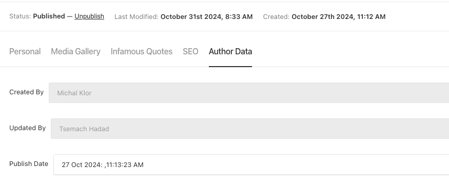
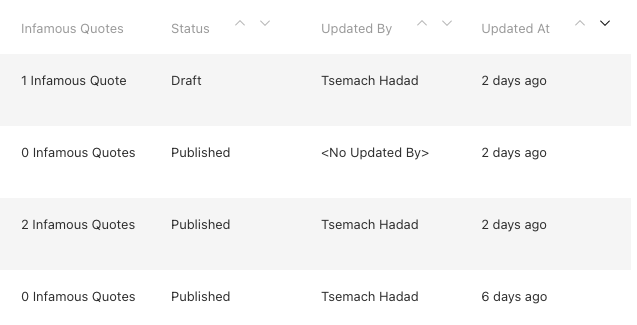

# Shefing Payload Admin Helpers

Helpers and practices to start payload cms admin project

This project was built with [PayloadCMS](https://payloadcms.com/) and [Next.js 15](https://nextjs.org/), focusing on providing advanced and customize payload services.

## Table of Contents

- [✨ Features](#features)
  - Researcher to Author workflow
    (Right Panel , Quotes , Media)
  - Control who can publish content
  - Using field level security to control which fields are in the API
  - Produce cover image from video
  - Block removal of media if referenced from publishable content
  - Right panel open relation
  - Generating content from selection in rich text (TextFromSelectionField)
  - Control row label (RowLabel)
  - Slug component with redirects integration
  - integrating pino and logtail
  - close navigation bar on edit
  - Custom Version View
  - Live Preview integration
- [🚀 Plugins](#getting-started)
  - [💻 Access plugin](#accessplugin)
  - [💁 Author fields plugin](#author-fields-plugin)
  - [📝 Comments plugin](#comments-plugin)
  - [👥️ Cross Collection config](#cross-collection-config) - utilizing metadata collection to inject behavior
  - [🖼️ Media Authoring plugin](#media-authoring-plugin) - replacing component for all media in the system
- [🚀 Style changes](#style-changes)
  - layout
  - left labels
  - media
  - rich text
- [🚀 Blocks](#blocks)
  - Extending blocks (const carouselMediaBlock: Block = JSON.parse(JSON.stringify(MediaBlock));
    )
  - defaulting text to block label
- [🧭 UI Components](#ui-components)
  - Color picker components
  - Icon select field
  - Shadcn tailwind integration
- [💾 Database migrations](#database)
  - Process rich text field
  - Changing type of field
  - Migrate legacy data with upsert support
  - Change string field to use relation field
  - Importing from CSV/JSON/TypeSense API
- [🚀 Deployment](#deployment)
  - docker
  - docker compose

## [Access plugin](./src/plugins/access/accessPlugin.ts)

We wanted to create a plugin which will enable flexibility in setting the user roles

An admin can set [Roles](./src/collections/auth/Roles.ts) according to the organization needs

Roles have a list of permissions

Each permission contains a list of globals/collections, and defines read/write/etc options

For example:


After defining the roles ,an admin can assign the roles to the users:


$${\color{red}??????}$$
//TODO: move 'users', 'roles', 'media' to configuration $${\color{red}??????}$$

**The plugin does the following:**

1. Collects all content types for showing them in the permission drop down.

2. Gos over all the collectiona and globals in the system and assign them the access APIs according to the definition done by Admin.

3. Sets Cell display for createAt and updatedAt fields to use moment.js relation time

## [Author Fields plugin](./src/plugins/author-fields/authorFieldPlugin.ts)

Payload is storing the modification and creation date of each document's collections.

We have the need to store the following as well:

1. User who created or updated the document.
2. Publish date of the document (For publishable content)

All this data is computed and rendered for each collection under Author Data Tab:



On list views, dates are presented in moment.js relation format like:



## [Comments plugin](./src/plugins/CommentsPlugin.ts)

We wanted to create a plugin which will enable the ability to add comments between users over a text from RichText field

The user can add comment on selected text to start a discussion about this content:


Comments section is available on the right side of the screen and users can reply or delete comment


In addition, there is highlight mark on text that has comments


```

```
